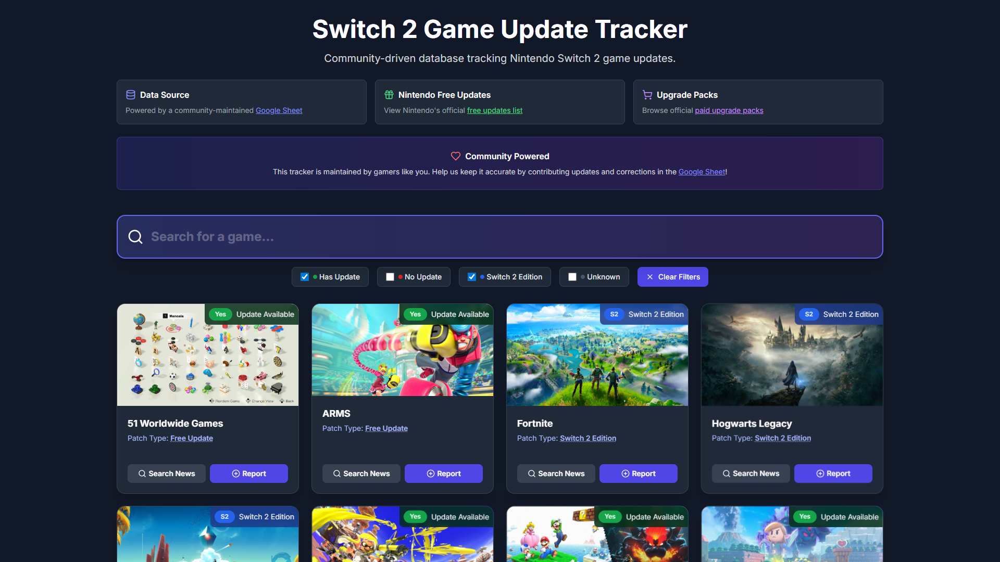

# Nintendo Switch 2 Game Update Tracker

A simple single-file web application that tracks Nintendo Switch 2 game updates (whether it's frame rate, resolution, stability, etc.). This project helps gamers stay informed about which games have received updates for the Nintendo Switch 2 console.

The data for Switch 2 udpated come from this [awesome community-driven Google Sheet](https://docs.google.com/spreadsheets/d/1sOYZRiOuD9Cnr-e_hlzhRuxuEq5X5Ptwq4yCfwxyfFk/edit?usp=sharing).

My project just makes it a bit easier to search for and identify which games have received (or not) a performance update, plus gathering other useful links for official Nintendo upgrade packs and other free updates.

Here's how the website looks:

## Technologies Used

- **Frontend**: HTML, CSS, JavaScript
- **Styling**: Tailwind CSS
- **Icons**: Lucide Icons
- **Fonts**: Google Fonts (Inter)
- **Data Source**: Google Sheets API
- **Game Images**: RAWG API, CheapShark API

## Contributing

Any contribution is highly appreciated! Here are ways you can help:

### Reporting Game Updates

1. Use the "Contribute Update" button on the website
2. Fill out the form with:
   - Game title
   - Update status
   - Source/reference link
3. Submit for review

> [!WARNING]
> The "Report" feature does not work, yet. Please contribute directly to the Google Sheet for now.

### Code Contributions

1. Fork the repository
2. Clone your fork to your local machine (`git clone https://github.com/<your-username>/<repo-name>.git`)
3. Create a feature branch (`git checkout -b feature/new-feature`)
4. Commit your changes (`git commit -m 'Add new feature'`)
5. Push to the branch (`git push origin feature/new-feature`)
6. Open a Pull Request

### Bug Reports

Please ~~use the feedback form on the website or~~ create an issue on GitHub with:

- Description of the bug
- Steps to reproduce
- Expected vs actual behavior
- Browser/device information

## Known Issues

- Game images may take time to load on slower connections
- Some games might not have available images from the APIs
- Contribution and feedback forms are demo-only for now (no backend storage, all client side)
- The RAWG API key is not obscured in the client; please use responsibly (I don't care if you use that key, but you will make the website experience worse for everyone for no reason, so just use you API key for things outside this website)
- There is a monthly RAWG API limit of 20,000 images fetched

## 🚧 Future Enhancements 🚧

- [ ] Backend integration for storing contributions (or with Google Sheet?)
- [ ] Advanced sorting options
- [ ] Dark/light theme toggle
- [ ] Push notifications for new updates
- [ ] Game comparison features

## License

This project is licensed under the MIT License - see the [LICENSE](LICENSE.txt) file for details.

## Acknowledgments

- Nintendo for creating the Switch 2 console, of course :)
- [RAWG](https://rawg.io/) for game data and images
- [CheapShark](https://www.cheapshark.com/) for additional game iamges for free
- [Tailwind CSS](https://tailwindcss.com/) for styling
- [Lucide](https://lucide.dev/) for icons
- The gaming community for data contributions

> [!NOTE]
> This is a community project and is not officially affiliated with Nintendo. Game information is sourced from public APIs and community contributions.
